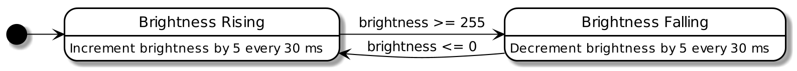
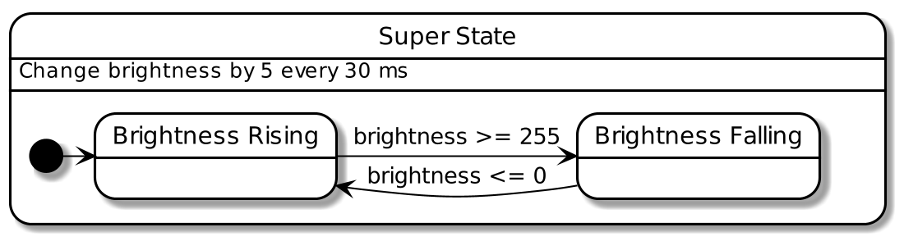

# Rios - Reactive Input/Output States

Rios is a language for programming embedded electronics.
It is not meant to be a general replacement for C, but to replace it in the embedded programming of devices that behave like state machines.

Rios works especially well for many Arduino applications, and translations of many Arduino examples can be found in the `examples` folder.

## Why Rios?
A good example to compare the readability of Rios code to standard Arduino code, is to take a look at the Arduino [fade](http://www.arduino.cc/en/Tutorial/Fade) example.
The fade example is basically a simple state machine that can be described as:



This can be written in Rios as:
```haskell
pin led = output@9

default state Rising {
  when brightness >= 255 : enter Falling
  every 30 ms : *led += 5;
}

state Falling {
  when brightness <= 0 : enter Rising
  every 30 ms : *led -= 5;
}
```

To understand why this is the case and how it works, we can look at how the fade example is implemented in Arduino code.

## Translating from Arduino
The fade example from the Arduino documentation is implemented as follows:
```C++
int led = 9;           // the PWM pin the LED is attached to
int brightness = 0;    // how bright the LED is
int fadeAmount = 5;    // how many points to fade the LED by

void setup() {
  // declare pin 9 to be an output:
  pinMode(led, OUTPUT);
}

void loop() {
  analogWrite(led, brightness);

  brightness = brightness + fadeAmount;

  if (brightness <= 0 || brightness >= 255) {
    fadeAmount = -fadeAmount;
  }

  delay(30);
}
```

If we take the very direct way of translating this to Rios, we might end up with the following code:

```haskell
pin led = output@9
mut int8 brightness = 0
mut int8 fadeAmount = 5

default state Rising {
  every 30 ms : [
    *led = brightness;
    brightness += fadeAmount;
  ]
  when brightness >= 255 : enter Falling
  onenter : fadeAmount = 5
}

state Falling {
  every 30 ms : [
    *led = brightness;
    brightness += fadeAmount;
  ]
  when brightness <= 0 : enter Falling
  onenter : fadeAmount = -5
}
```

The active reactions (or edges) of Rios, is dependent on the current state the program is in. Rios has substating, so we could also define a state where the `every 30 ms` reactions are both in, and make that a superstate.



Rios wraps the root of the code in a superstate automatically, so we just need to move the `every` reaction of of the two states.

```haskell
pin led = output@9
mut int8 brightness = 0
mut int8 fadeAmount = 5

every 30 ms : [
  *led = brightness;
  brightness += fadeAmount;
]

default state Rising {
  when brightness >= 255 : enter Falling
  onenter : fadeAmount = 5
}

state Falling {
  when brightness <= 0 : enter Falling
  onenter : fadeAmount = -5
}
```

This code is definitely better, but we can do better. We don't need the brightness, as Rios allows us to read the value assigned to a PWM pin.

```haskell
pin led = output@9
mut int8 fadeAmount = 5

every 30 ms : *led += fadeAmount

default state Rising {
  onenter : fadeAmount = 5
  when *led >= 255 : enter Falling
}

state Falling {
  onenter : fadeAmount = -5
  when *led <= 0 : enter Rising
}
```

It might also be clearer to define the transitions together, so we don't have to find the definitions. This is again done by having the `when` reactions lie in the superstate. Thus the code becomes:

```haskell
pin led = output@9
mut int8 fadeAmount = 5

every 30 ms : *led += fadeAmount
when *led
  | >= 255 : enter Falling
  | <= 0 : enter Rising

default state Rising {
  onenter : fadeAmount = 5
}

state Falling {
  onenter : fadeAmount = -5
}
```

But even this has unneccesary complexity. Having `fadeAmount` be a mutable variable is not really in the spirit of reactive programming. So the following program might be easier to read, and a lot close to how a diagram of the program could be drawn.

```haskell
pin led = output@9
int8 fadeAmount = 5
time delayInterval = 30 ms

when *led
  | >= 255 : enter Falling
  | <= 0 : enter Rising

default state Rising {
  every delayInterval : *led += fadeAmount
}

state Falling {
  every delayInterval : *led -= fadeAmount
}
```

Alternatively, we could double down on the imperative programming ways by using the mutable `fadeAmount` and not defining any states. This will then be seen as a stateless program, but having mutable variables will, naturally, introduce states into the program.


```haskell
pin led = output@9
mut int8 fadeAmount = 5

every 30 ms : *led += fadeAmount

when *led
  | >= 255 : fadeAmount = -5
  | <= 0 : fadeAmount = 5
```
